# Maven私服搭建

## Nexus 介绍

**Nexus** 是一个专门的 **Maven** 仓库管理软件，它不仅能搭建 **Maven** 私服，还具备如下一些优点使其日趋成为最流行的 **Maven** 仓库管理器：

- 提供了强大的仓库管理功能，构件搜索功能
- 它基于 **REST**，友好的 **UI** 是一个 **ext.js** 的 **REST** 客户端
- 它占用较少的内存
- 基于简单文件系统而非数据库


## Nexus 安装

### 前置条件

> 安装JDK

### 使用二进制发行包安装

1. 点击 `官网`https://www.sonatype.com/nexus-repository-oss 点击“**GET REPOSITORY OSS**”按钮打开下载页面

   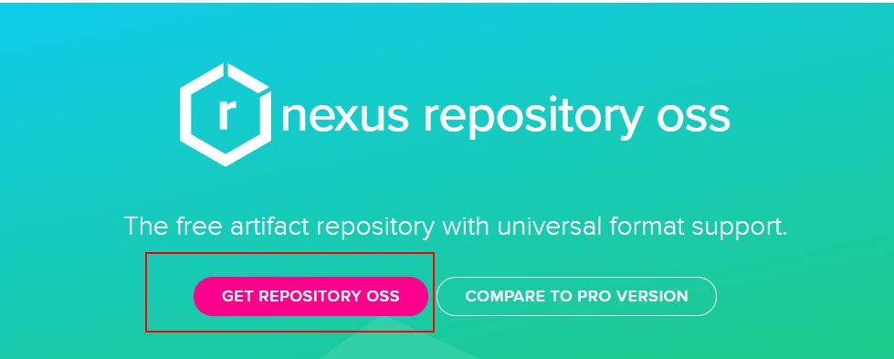

2. 根据环境选择下载相应的版本，比如我这里下载 **Linux** 版本的安装包。
   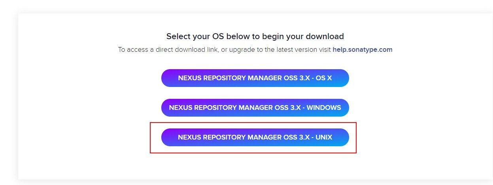

3. 将下载的压缩包上传至服务器并解压

   ```shell
   tar -zxvf nexus-3.33.1-01-unix.tar.gz 
   ```

4. 解压后会得到两个文件夹：`nexus-3.33.1-01`和`sonatype-work`

5. 进入`nexus-3.33.1-01`文件夹，其中 **etc/nexus-default.properties** 文件配置端口（默认为 **8081**）和 **work** 目录信息，我们可以按需修改。

   ```shell
   cd nexus-3.33.1-01
   cat etc/nexus-default.properties
   ```

   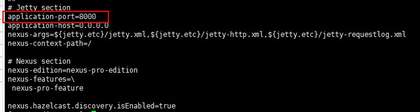

6. 开放端口(如果是云端服务器需要配置安全组进行端口开放)

   ```
   firewall-cmd --permanent --add-port=8081/tcp
   firewall-cmd --reload
   ```

7. 执行启动命令

   ```shell
   cd bin
   ./nexus start
   ```

### Docker启动

1. 首先执行如下命令下载 **Nexus3** 镜像：

   ```shell
   docker pull sonatype/nexus3
   ```

2. 接着执行如下命令，创建宿主机挂载目录：

   ```shell
   mkdir –vp /usr/local/nexus-data
   ```

3. 最后执行如下命令运行 **Nexus3** 容器即可：

   ```shell
   docker run -d --name nexus3 -p 8081:8081 -v /usr/local/nexus-data:/var/nexus-data sonatype/nexus3
   ```

4. 开放端口(如果是云端服务器需要配置安全组进行端口开放)

   ```shell
   firewall-cmd --permanent --add-port=8081/tcp
   firewall-cmd --reload
   ```

## Nexus服务配置

### 登录

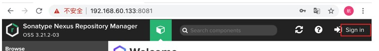

- 用户名：admin
- 密码：**首次登录会提示密码保存在 sonatype-work/nexus3/admin.password**

### 登录后界面说明

```
（1）默认仓库说明：
    maven-central：maven 中央库，默认从 https://repo1.maven.org/maven2/ 拉取 jar
    maven-releases：私库发行版 jar，初次安装请将 Deployment policy 设置为 Allow redeploy
    maven-snapshots：私库快照（调试版本）jar
    maven-public：仓库分组，把上面三个仓库组合在一起对外提供服务，在本地 maven 基础配置 settings.xml 或项目 pom.xml 中使用
（2）仓库类型说明：
    group：这是一个仓库聚合的概念，用户仓库地址选择 Group 的地址，即可访问 Group 中配置的，用于方便开发人员自己设定的仓库。maven-public 就是一个 		Group 类型的仓库，内部设置了多个仓库，访问顺序取决于配置顺序，3.x 默认为 Releases、Snapshots、Central，当然你也可以自己设置。
    hosted：私有仓库，内部项目的发布仓库，专门用来存储我们自己生成的 jar 文件
    snapshots：本地项目的快照仓库
    releases： 本地项目发布的正式版本
    proxy：代理类型，从远程中央仓库中寻找数据的仓库（可以点击对应的仓库的 Configuration 页签下 Remote Storage 属性的值即被代理的远程仓库的路径），如可	   配置阿里云 maven 仓库
central：中央仓库
```

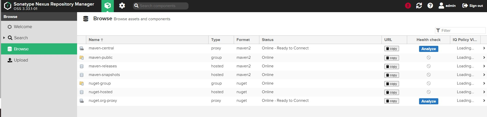

### 接下来我们增加一个代理仓库，使用的是阿里云公共仓库

1. 首先点击“**Create repository**”按钮开始创建一个仓库

   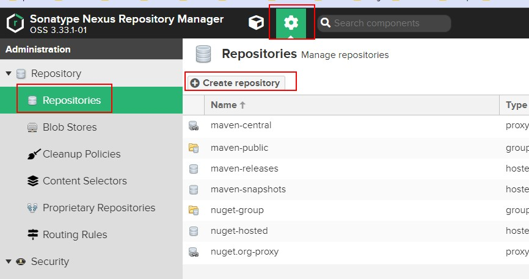

2. 类型选择 **maven2**（**proxy**）：

   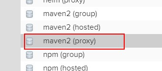

3. 配置阿里云地址 **http://maven.aliyun.com/nexus/content/groups/public/**，**name** 可以随意填（这里我写 **aliyun-proxy**）,然后点击最下方按钮创建

   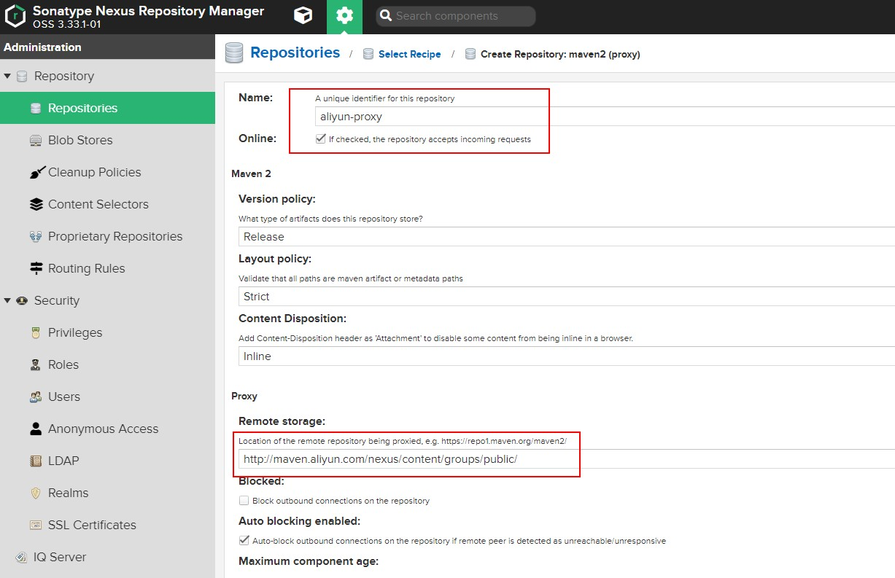

4. 阿里云代理仓库创建完毕后，我们编辑 **maven-public**，将其添加到放入 **group** 中，并调整优先级，然后保存：

   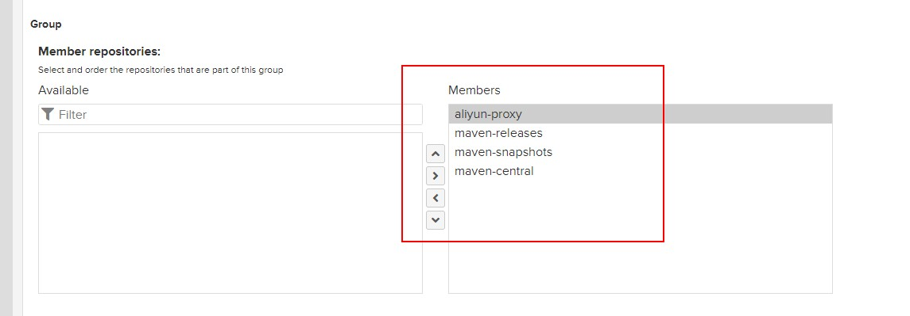

5. 点击 **maven-public** 条目的 **copy** 按钮即可拷贝私服地址：

   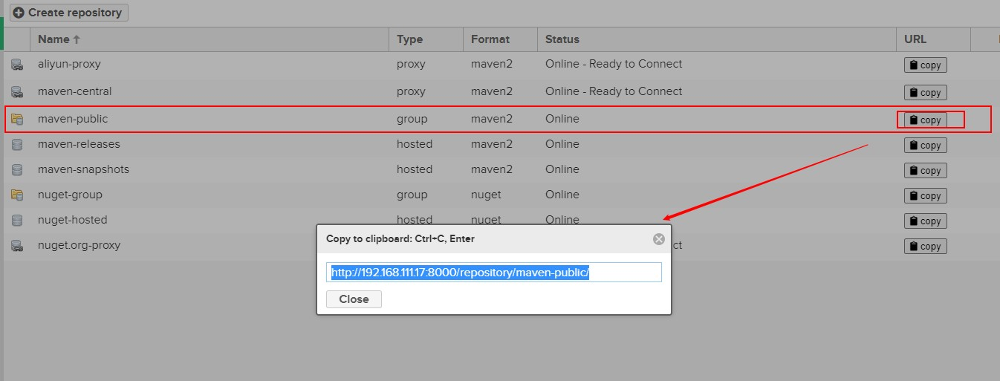

## 私服使用

### 基本说明

1. **Maven** 配置私服下载有两种方式：

   - **setting.xml**：该文件配置的是全局模式

   - **pom.xml**：该文件的配置的是项目独享模式

> **注意**：若 **pom.xml** 和 **setting.xml** 同时配置了，以 **pom.xml** 为准

2. 当我们在 **maven** 使用 **maven-public** 仓库地址的时候，会按照如下顺序访问：**本地仓库** --> **私服 maven-releases** --> **私服 maven-snapshots** --> **远程阿里云 maven 仓库** --> **远程中央仓库**。

### Maven 配置使用私服（下载依赖）

#### 通过 setting.xml 文件配置

1. **setting.xml** 文件配置样例如下。配置后不需要再配置 **pom.xml** 文件，即可通过私服下载 **jar** 依赖包。

   ```xml
   <mirrors>
       <mirror>
           <!--该镜像的唯一标识符。id用来区分不同的mirror元素。 -->
           <id>maven-public</id>
           <!--镜像名称 -->
           <name>maven-public</name>
           <!--*指的是访问任何仓库都使用我们的私服-->
           <mirrorOf>*</mirrorOf>
           <!--该镜像的URL。构建系统会优先考虑使用该URL，而非使用默认的服务器URL。 -->
           <url>http://192.168.60.133:8081/repository/maven-public/</url>     
       </mirror>
   </mirrors>
   ```

2. 如果我们并没有搭建私服，属于个人开发，那么也可以直接配置使用阿里 云**maven** 仓库：

   ```xml
   <mirror>
     <id>nexus-aliyun</id>
     <name>Nexus aliyun</name>
     <mirrorOf>*</mirrorOf>
     <url>http://maven.aliyun.com/nexus/content/groups/public</url>
   </mirror>
   ```

#### 通过 pom.xml 文件配置

1. **pom.xml** 文件配置样例如下。如果我们配置了 **pom.xml**，则以 **pom.xml** 为准。

   ```xml
   <repositories>
       <repository>
           <id>maven-nexus</id>
           <name>maven-nexus</name>
           <url>http://192.168.60.133:8081/repository/maven-public/</url>
           <releases>
               <enabled>true</enabled>
           </releases>
           <snapshots>
               <enabled>true</enabled>
           </snapshots>
       </repository>
   </repositories>
   ```

2. 如果没有私服，我们同样也可以配置阿里云 **maven** 仓库：

   ```shell
   <repositories>
      <repository>
         <id>maven-aliyun</id>
         <url>http://maven.aliyun.com/nexus/content/groups/public/</url>
         <releases>
            <enabled>true</enabled>
         </releases>
         <snapshots>
            <enabled>true</enabled>
            <updatePolicy>always</updatePolicy>
            <checksumPolicy>fail</checksumPolicy>
         </snapshots>
      </repository>
   </repositories>
   ```

### Maven 配置使用私服（下载插件）

下面是一个使用 **pom.xml** 配置样例：

```xml
<pluginRepositories>
    <pluginRepository>
        <id>maven-nexus</id>
        <name>maven-nexus</name>
        <url>http://10.172.0.201:8081/nexus/repository/maven-public/</url>
        <releases>
            <enabled>true</enabled>
        </releases>
        <snapshots>
            <enabled>true</enabled>
        </snapshots>
    </pluginRepository>
</pluginRepositories>
```

### Maven 配置使用私服（发布依赖）

1. 首先修改 **setting.xml** 文件，指定 **releases** 和 **snapshots server** 的用户名和密码：

   ```xml
   <servers>
       <server>
           <id>releases</id>
           <username>admin</username>
           <password>123</password>
       </server>
       <server>
           <id>snapshots</id>
           <username>admin</username>
           <password>123</password>
       </server>
   </servers>
   ```

2. 接着在项目的 **pom.xml** 文件中加入 **distributionManagement** 节点：

   > **注意**：**repository** 里的 **id** 需要和上一步里的 **server id** 名称保持一致。

   ```xml
   <distributionManagement>
       <repository>
           <id>releases</id>
           <name>Releases</name>
           <url>http://192.168.60.133:8081/repository/maven-releases/</url>
       </repository>
       <snapshotRepository>
           <id>snapshots</id>
           <name>Snapshot</name>
           <url>http://192.168.60.133:8081/repository/maven-snapshots/</url>
       </snapshotRepository>
   </distributionManagement>
   ```

3. 执行 **mvn deploy** 命令发布：

   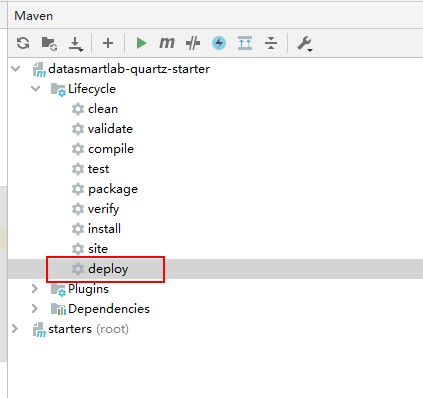

4. 登录 **Nexus**，查看对应的仓库已经有相关的依赖包了。

   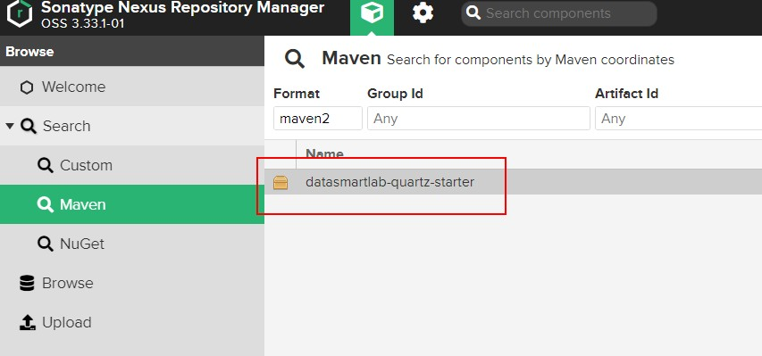

   **发布到的仓库说明：**

   - 若项目版本号末尾带有 **-SNAPSHOT**，则会发布到 **snapshots** 快照版本仓库
   - 若项目版本号末尾带有 **-RELEASES** 或什么都不带，则会发布到 **releases** 正式版本仓库


**注意：**

如果发布的是父工程项目需要将父工程也发布到私服上